# Resumen de la Estructura Completa del Proyecto

A continuación se muestra un análisis completo compuesto por:

- [**Diagrama Mermaid**](#-esquema-de-flujo-de-llamadas-del-proyecto): Visualización del flujo de dependencias
- [**Tabla de dependencias**](#-tabla-detallada-de-dependencias): Cada función, a qué llama y de dónde
- [**Flujos principales**](#-flujos-principales): Los dos escenarios clave del proyecto
- [**Capas arquitectónicas**](#-capas-de-la-arquitectura): Cómo se organiza el proyecto en niveles

## 📊 Esquema de Flujo de Llamadas del Proyecto

```mermaid
graph TB
    subgraph "main.py<br/>(Punto de Entrada)"
        main["main()"]
        demo_est["demo_verificar_estructura()"]
        demo_clasif["demo_clasificar_consultas()"]
        demo_chat["demo_chat_con_contexto()"]
        impr_res["imprimir_resultado()"]
    end

    subgraph "logic.py<br/>(Orquestación)"
        clasif_consulta["clasificar_consulta()"]
        parsear_clasif["parsear_clasificacion()"]
        responder_chat["responder_chat()"]
        demo_sel_faq["demo_seleccion_faq()"]
        resp_ok["respuesta_ok()"]
        resp_err["respuesta_error()"]
    end

    subgraph "prompts.py<br/>(Construcción de Prompts)"
        build_clasif["build_clasificacion_prompt()"]
        build_chat["build_chat_prompt()"]
        build_perfil["build_perfil_block()"]
        build_faq["build_faq_block()"]
        build_historial["build_historial_block()"]
    end

    subgraph "state.py<br/>(Gestión de Estado)"
        init_est["inicializar_estado()"]
        append_user["append_user()"]
        append_model["append_model()"]
        ultimos_n["ultimos_n()"]
        guardar_clasif["guardar_clasificacion()"]
    end

    subgraph "context.py<br/>(Selección FAQ)"
        cargar_faq["cargar_faq()"]
        selec_faq["seleccionar_faq()"]
    end

    subgraph "validators.py<br/>(Validación)"
        val_consulta["validar_consulta()"]
    end

    subgraph "gemini_client.py<br/>(Llamadas API)"
        count_tok["count_tokens()"]
        llamar_json["llamar_gemini_json()"]
        llamar_texto["llamar_gemini_texto()"]
        safe_gen_txt["safe_generate_texto()"]
    end

    subgraph "config.py<br/>(Constantes)"
        config["MODEL, TEMPERATURE<br/>CATEGORIAS, PRIORIDADES<br/>MAX_TOKENS, WINDOW, etc."]
    end

    subgraph "gemini_auth.py<br/>(Autenticación)"
        config_auth["configurar_gemini_api_key()"]
    end

    %% main.py calls
    main --> demo_est
    main --> demo_clasif
    main --> demo_chat
    
    demo_est --> cargar_faq
    demo_clasif --> clasif_consulta
    demo_chat --> demo_sel_faq
    demo_chat --> init_est
    demo_chat --> responder_chat
    
    impr_res -.-> main

    %% logic.py calls
    clasif_consulta --> val_consulta
    clasif_consulta --> build_clasif
    clasif_consulta --> llamar_json
    clasif_consulta --> parsear_clasif
    clasif_consulta --> resp_ok
    clasif_consulta --> resp_err
    
    demo_sel_faq --> cargar_faq
    demo_sel_faq --> selec_faq
    
    responder_chat --> build_chat
    responder_chat --> safe_gen_txt
    responder_chat --> append_user
    responder_chat --> append_model
    responder_chat --> resp_ok
    responder_chat --> resp_err

    %% prompts.py calls
    build_chat --> build_perfil
    build_chat --> build_faq
    build_chat --> build_historial

    %% state.py usage
    responder_chat -.-> ultimos_n

    %% validators.py
    clasif_consulta -.-> val_consulta

    %% gemini_client.py
    safe_gen_txt --> count_tok
    safe_gen_txt --> llamar_texto
    llamar_json --> config_auth
    llamar_texto --> config_auth

    %% config references
    val_consulta -.-> config
    build_perfil -.-> config
    build_faq -.-> config
    build_historial -.-> config
    safe_gen_txt -.-> config
    llamar_json -.-> config
    llamar_texto -.-> config

    style main fill:#ff6b6b
    style logic.py fill:#4ecdc4
    style prompts.py fill:#45b7d1
    style state.py fill:#96ceb4
    style context.py fill:#dfe6e9
    style validators.py fill:#ffeaa7
    style gemini_client.py fill:#d4a5ff
    style config.py fill:#e8e8e8
    style gemini_auth.py fill:#e8e8e8
```



## 📋 Tabla Detallada de Dependencias

| **Archivo** | **Función** | **Llama a** | **Origen** | **Tipo** |
|---|---|---|---|---|
| **main.py** | `main()` | Todas las demos | Mismo archivo | Orquestación |
| | `demo_verificar_estructura()` | `cargar_faq()` | context.py | Datos |
| | `demo_clasificar_consultas()` | `clasificar_consulta()` | logic.py | Orquestación |
| | `demo_chat_con_contexto()` | `demo_seleccion_faq()`, `inicializar_estado()`, `responder_chat()`, `cargar_faq()`, `seleccionar_faq()` | logic.py, state.py, context.py | Orquestación |
| | `imprimir_resultado()` | - | Mismo archivo | Utilidad |
| **logic.py** | `clasificar_consulta()` | `validar_consulta()`, `build_clasificacion_prompt()`, `llamar_gemini_json()`, `parsear_clasificacion()`, `respuesta_ok()`, `respuesta_error()` | validators.py, prompts.py, gemini_client.py, Mismo archivo | Núcleo |
| | `parsear_clasificacion()` | - | config.py (constantes) | Validación |
| | `responder_chat()` | `build_chat_prompt()`, `safe_generate_texto()`, `append_user()`, `append_model()`, `respuesta_ok()`, `respuesta_error()` | prompts.py, gemini_client.py, state.py, Mismo archivo | Núcleo |
| | `demo_seleccion_faq()` | `cargar_faq()`, `seleccionar_faq()` | context.py | Utilidad |
| | `respuesta_ok()` | - | - | Utilidad |
| | `respuesta_error()` | - | - | Utilidad |
| **prompts.py** | `build_clasificacion_prompt()` | - | config.py (constantes) | Construcción |
| | `build_chat_prompt()` | `build_perfil_block()`, `build_faq_block()`, `build_historial_block()` | Mismo archivo | Construcción |
| | `build_perfil_block()` | - | - | Construcción |
| | `build_faq_block()` | - | - | Construcción |
| | `build_historial_block()` | - | - | Construcción |
| **state.py** | `inicializar_estado()` | - | - | Estado |
| | `append_user()` | - | - | Utilidad |
| | `append_model()` | - | - | Utilidad |
| | `ultimos_n()` | - | - | Utilidad |
| | `guardar_clasificacion()` | - | - | Utilidad (sin implementar) |
| **context.py** | `cargar_faq()` | - | Lee data/faq.json | Datos |
| | `seleccionar_faq()` | - | - | Datos |
| **validators.py** | `validar_consulta()` | - | config.py (constantes) | Validación |
| **gemini_client.py** | `count_tokens()` | - | config.py (constantes) | API |
| | `llamar_gemini_json()` | `configurar_gemini_api_key()` | gemini_auth.py | API |
| | `llamar_gemini_texto()` | `configurar_gemini_api_key()` | gemini_auth.py | API |
| | `safe_generate_texto()` | `count_tokens()`, `llamar_gemini_texto()` | Mismo archivo | API |
| **config.py** | - | (Solo constantes) | - | Configuración |
| **gemini_auth.py** | `configurar_gemini_api_key()` | (Cargado por gemini_client.py) | - | Autenticación |

## 🔄 Flujos Principales

### **Flujo 1: Clasificación de Consultas (Fase 1)**
```
main() 
  → demo_clasificar_consultas()
    → clasificar_consulta()
      → validar_consulta()            [Validación]
      → build_clasificacion_prompt()  [Construcción de prompt]
      → llamar_gemini_json()          [Llamada a API]
      → parsear_clasificacion()       [Parsing JSON]
      → respuesta_ok() / respuesta_error()
```

### **Flujo 2: Chat con Contexto (Fase 2)**
```
main() 
  → demo_chat_con_contexto()
    → inicializar_estado()            [Crear sesión]
    → cargar_faq()                    [Cargar datos]
    → seleccionar_faq()               [Filtrar FAQ relevante]
    → responder_chat()
      → build_chat_prompt()           [Construir prompt con contexto]
        → build_perfil_block()
        → build_faq_block()
        → build_historial_block()
        → ultimos_n()                 [Últimos mensajes]
      → safe_generate_texto()         [Llamada segura a API]
        → count_tokens()              [Validar contexto]
        → llamar_gemini_texto()       [Generar respuesta]
      → append_user()                 [Guardar pregunta]
      → append_model()                [Guardar respuesta]
      → respuesta_ok()
```

## 📌 Capas de la Arquitectura

| **Capa** | **Archivos** | **Responsabilidad** |
|---|---|---|
| **Entrada** | main.py | Demos y punto de entrada; impresión de resultados |
| **Orquestación** | logic.py | Coordina el flujo de clasificación y chat; maneja respuesta ok/error |
| **Validación** | validators.py | Valida nombre, email y mensaje antes de procesamiento |
| **Construcción de Prompts** | prompts.py | Ensambla prompts dinámicos con bloques de perfil, FAQ e historial |
| **Gestión de Estado** | state.py | Mantiene perfil del usuario y historial de mensajes en sesión |
| **Contexto Dinámico** | context.py | Carga y selecciona entradas relevantes del FAQ por keywords |
| **API** | gemini_client.py | Comunicación con la API de Gemini; manejo de tokens y métricas |
| **Config** | config.py | Capa transversal: Constantes globales (modelo, temperaturas, límites) |
| **Auth** | gemini_auth.py | Capa transversal: Configuración y carga de credenciales API |

## 🔗 Resumen de Dependencias Entre Capas

- **main.py** → logic.py, state.py, context.py
- **logic.py** → validators.py, prompts.py, context.py, state.py, gemini_client.py
- **prompts.py** → (solo constantes de config)
- **state.py** → (sin dependencias internas)
- **context.py** → (sin dependencias internas, lee datos de disco)
- **validators.py** → (solo constantes de config)
- **gemini_client.py** → gemini_auth.py, config
- **config.py** → (no depende de nada)
- **gemini_auth.py** → (dependencias externas: dotenv, getpass, os)
