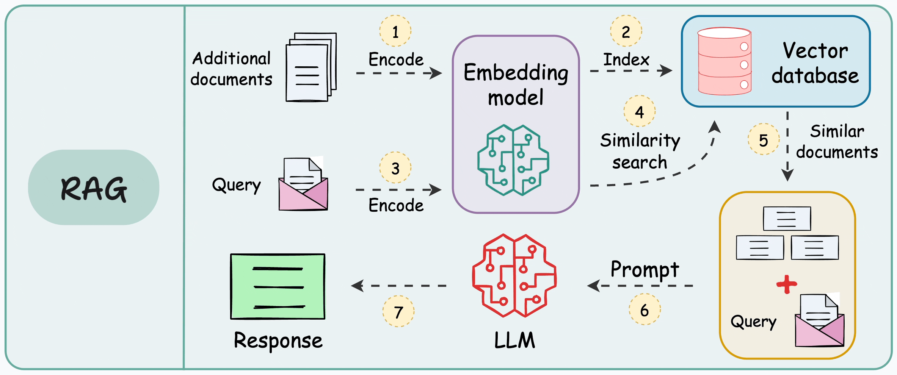

# Introducción: RAG y arquitectura

Hasta ahora has construido **asistentes con contexto manual**: FAQ filtrada por keywords, historial acotado, datos inyectados en el prompt. Eso funciona cuando el proyecto es **pequeño y estable**.

Con **RAG Engineering** aprendes a conectar un LLM con **documentos propios** (PDFs, políticas internas, manuales) de forma **automática y escalable**.

> **RAG (Retrieval-Augmented Generation)** = recuperar fragmentos relevantes de una base de conocimiento y pasárselos al LLM para que responda con ese contexto.

---

## Objetivos del bloque

Al terminar este bloque, deberías poder:

- Explicar **qué problema resuelve** un sistema RAG y cuándo **no** hace falta.
- Describir la **arquitectura en dos etapas**: recuperación y generación.
- Nombrar los **componentes principales** del pipeline (ingesta, chunking, embeddings, vector store, retriever, LLM).
- Diferenciar la fase **offline** (preparar conocimiento) de la **online** (responder consultas).

---

## Mapa del Módulo 4 (Sprints 8–10)

Cada sprint responde a **una pregunta**:

| Sprint | Pregunta | Qué haces |
|--------|----------|-----------|
| **08** | ¿Cómo convierto documentos en conocimiento? | Ingesta, chunking, embeddings |
| **09** | ¿Cómo recupero ese conocimiento? | ChromaDB, indexación, top-K, evaluación del retrieval |
| **10** | ¿Cómo uso ese conocimiento para responder? | Prompt con contexto, robustez, aplicación RAG |

```text
Sprint 8          Sprint 9           Sprint 10
────────          ────────           ─────────
PDF ──► chunks ──► embeddings ──► Chroma ──► retrieve ──► prompt + LLM ──► respuesta
        (offline)                  (online)
```



En el **Sprint 8** solo llegas hasta **embeddings persistidos**. Todavía no indexas en Chroma ni generas respuestas finales.

---

## Tabla guía de lectura

| # | Documento | Enfoque |
|---|-----------|---------|
| 1 | [Qué es RAG y limitaciones del LLM](./01_que_es_rag_y_limitaciones_llm.md) | Problema de negocio y casos de uso |
| 2 | [Arquitectura y componentes](./02_arquitectura_y_componentes.md) | Flujo técnico del sistema |
| 3 | [Tecnologías del módulo](./03_tecnologias_del_modulo.md) | Stack y convenciones |
