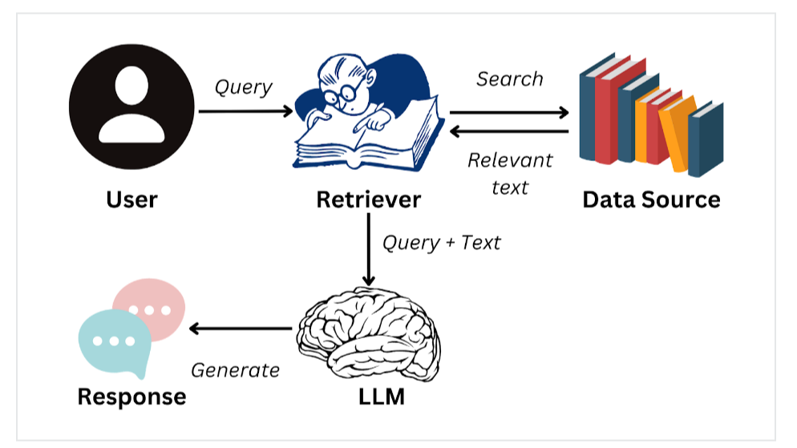

# Qué es RAG y limitaciones del LLM

Un LLM generativo **no conoce por defecto** la documentación interna de tu empresa, la información de tus clientes, proveedores, etc. Fue entrenado con datos generales y tiene una **fecha de corte** de conocimiento.

**RAG** permite que el modelo responda **anclado a tus documentos**, sin reentrenar todo el modelo cada vez que cambia un PDF. Con **RAG** podemos alimentar el sistema con documentos en formato PDF, CSV, JSON, etc. La idea es que el modelo LLM pueda acceder a la información de los documentos y responder preguntas sobre ellos.



---

## Objetivos

- Entender las **limitaciones** de un LLM usado solo con prompt.
- Reconocer **casos de uso** donde RAG aporta valor.
- Comparar **tres enfoques** para dar conocimiento al modelo: prompt engineering, fine-tuning y RAG.

---

## 1) Limitaciones de un LLM sin contexto adecuado

| Limitación | Qué significa en la práctica |
|------------|----------------------------|
| **Conocimiento desactualizado** | No sabe regulaciones, precios o políticas publicadas después de su entrenamiento. |
| **Sin acceso a docs privados** | No ha leído tus contratos, manuales internos ni bases de datos propietarias. |
| **Alucinaciones** | Puede inventar datos plausibles (fechas, cifras, nombres) si no tiene fuente. |
| **Ventana de contexto finita** | No puedes pegar 500 PDFs enteros en un solo prompt. |
| **Poca trazabilidad** | Difícil saber *de qué documento* salió una afirmación. |

Estas limitaciones **no hacen inútil al LLM**. Significan que, para apps con documentación propia, necesitas un **mecanismo de contexto** diseñado con criterio.

---

## 2) ¿Qué es un sistema RAG?

**Retrieval-Augmented Generation** combina:

1. **Retrieval (recuperación):** buscar fragmentos de texto relevantes en tu base de conocimiento (corpus o índice) de RAG.
2. **Augmented (aumentado):** añadir esos fragmentos al prompt del LLM.
3. **Generation (generación):** el LLM redacta la respuesta usando ese contexto.

```text
Usuario: "¿Cuál es el plazo de devolución según la política?"
                    │
                    ▼
         ┌──────────────────────┐
         │ 1. Embedding consulta │
         └──────────┬───────────┘
                    ▼
         ┌──────────────────────┐
         │ 2. Buscar top-K chunks│  ← base vectorial
         └──────────┬───────────┘
                    ▼
         ┌──────────────────────┐
         │ 3. Prompt + contexto │
         └──────────┬───────────┘
                    ▼
         ┌──────────────────────┐
         │ 4. LLM genera respuesta │
         └──────────────────────┘
```

El LLM **no memoriza** tus PDFs en entrenamiento: **los consulta en tiempo de inferencia** a través del retriever.


---

## 3) Casos de uso típicos

| Caso | Por qué encaja RAG |
|------|------------------|
| **Soporte interno** | Respuestas sobre políticas HR, IT o procedimientos en PDF. |
| **Tutor sobre syllabus** | Preguntas sobre contenidos, fechas y evaluación del bootcamp. |
| **Asistente legal/compliance** (básico) | Consultas sobre cláusulas concretas en contratos. |
| **Documentación técnica** | API docs, runbooks, guías de despliegue. |
| **Knowledge base empresarial** | Wikis y Notion exportados a texto/PDF. |

### Cuándo RAG **no** es la primera opción

| Situación | Enfoque más simple |
|-----------|-------------------|
| 5–10 FAQs fijas | Context Engineering manual (S5): FAQ en JSON + keywords |
| Cambiar solo el **tono** del bot | Prompt engineering o fine-tuning de estilo |
| Corpus minúsculo (1 página) | Prompt stuffing: pegar el texto en el prompt |
| Necesitas **razonamiento puro** sin docs | LLM directo, sin retrieval |

Regla práctica:

> Si el corpus **crece**, **cambia** a menudo o **no cabe** en el prompt → RAG merece la pena evaluarlo.

---

## 4) Tres formas de dar conocimiento al modelo, dependiendo de la complejidad y el coste

| Enfoque | Idea | Ventaja | Límite |
|---------|------|---------|--------|
| **Prompt engineering (contexto manual)** | Metes datos en el prompt (FAQ, CSV, extractos) | Rápido, barato, control total | No escala con corpus grande |
| **RAG (recuperar + generar)** | Recuperas chunks relevantes y los inyectas | Escala, actualizable, trazable | Calidad depende de chunking + retrieval |
| **Fine-tuning (reentrenar pesos del modelo)** | Reentrenas el modelo con datos etiquetados | Comportamiento muy especializado | Caro, lento; no sustituye docs que cambian cada semana |

**No compiten siempre:** en producto real puedes combinar prompt bien diseñado **+** RAG **+** validadores (S6).

---

## 5) Ejemplo conceptual: misma pregunta, distinto enfoque

**Pregunta:** *«¿Cuántos días tengo para entregar la práctica obligatoria del Sprint 8?»*

| Enfoque | Qué ocurre |
|---------|------------|
| **LLM solo** | Puede inventar un plazo genérico («7 días») sin base en tu syllabus. |
| **Prompt + FAQ manual (S5)** | Si la FAQ tiene esa entrada, responde bien; si no, falla. |
| **RAG** | Busca en el PDF del syllabus el párrafo sobre entregas y lo cita en contexto. |

RAG brilla cuando la respuesta está **en documentos** que el modelo no puede inferir solo.

---

## 6) RAG no elimina todos los riesgos

Incluso con RAG:

- El retriever puede traer **chunks irrelevantes** (ruido → respuesta confusa).
- El LLM puede **ignorar** el contexto y alucinar.
- Documentos mal troceados (**chunking**) parten información clave entre dos fragmentos.
- Texto malicioso **dentro de un PDF** puede intentar manipular al modelo (lo verás en S10).

Por eso el módulo separa **preparar** (S8), **recuperar bien** (S9) y **generar con robustez** (S10).

---

## Resumen

- Un LLM sin contexto adecuado **no conoce tus docs privados** y puede alucinar.
- **RAG** = recuperar fragmentos relevantes + generar respuesta con ese contexto.
- Usa RAG cuando el corpus es **grande, dinámico o privado**.
- **Prompt manual** sigue siendo válido para corpus pequeños.
- El siguiente paso será convertir documentos en **chunks y embeddings** listos para indexar.
