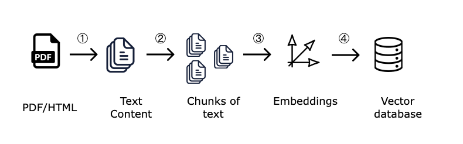
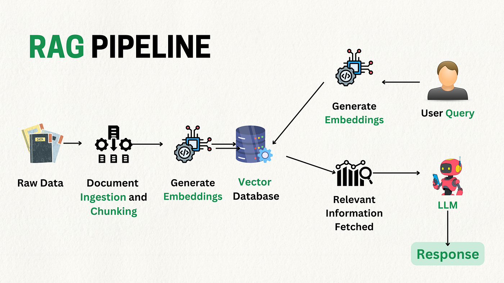

# Arquitectura y componentes de un sistema RAG

Un sistema RAG no es «un prompt largo». Es un **pipeline** con fases claras. Parte del trabajo ocurre **antes** de que el usuario haga una pregunta (offline); otra parte ocurre **en cada consulta** (online).

> **Recuperación ≠ generación.** Primero *buscas* fragmentos; después *redactas* la respuesta. Son dos responsabilidades distintas.

---

## Objetivos

- Identificar los **componentes principales** del pipeline RAG.
- Diferenciar flujo **offline** (indexación) y **online** (inferencia).
- Explicar el recorrido completo desde el PDF hasta la respuesta.
- Saber qué piezas verás en cada sprint del módulo.

---

## 1) Vista general en dos fases

```text
═══════════════════════════════════════════════════════════════
  FASE OFFLINE (Sprint 8 — preparar conocimiento)
═══════════════════════════════════════════════════════════════

  Documentos (PDF, MD, TXT…)
           │
           ▼
      ┌─────────┐
      │  LOAD   │  cargar y leer archivos
      └────┬────┘
           ▼
      ┌─────────┐
      │  CLEAN  │  normalizar texto (opcional pero habitual)
      └────┬────┘
           ▼
      ┌─────────┐
      │  CHUNK  │  dividir en fragmentos + metadatos
      └────┬────┘
           ▼
      ┌─────────┐
      │  EMBED  │  texto → vectores
      └────┬────┘
           ▼
      ┌─────────┐
      │  INDEX  │  guardar en base vectorial (Sprint 9)
      └─────────┘
```



```text
═══════════════════════════════════════════════════════════════
  FASE ONLINE (Sprints 9–10 — consultar y responder)
═══════════════════════════════════════════════════════════════

  Pregunta del usuario
           │
           ▼
      ┌──────────┐
      │  EMBED   │  consulta → vector
      └────┬─────┘
           ▼
      ┌──────────┐
      │ RETRIEVE │  top-K chunks similares (Sprint 9)
      └────┬─────┘
           ▼
      ┌──────────┐
      │  PROMPT  │  instrucciones + contexto + pregunta (Sprint 10)
      └────┬─────┘
           ▼
      ┌──────────┐
      │   LLM    │  generar respuesta (Sprint 10)
      └────┬─────┘
           ▼
      Respuesta (+ fuentes opcionales)
```



**Sprint 8:** solo la fase offline hasta embeddings.  
**Sprint 9:** index + retrieve (sin respuesta final del LLM).  
**Sprint 10:** prompt + generación + aplicación.

---

## 2) Componentes principales

| Componente | Función | Sprint |
|------------|---------|--------|
| **Document loader** | Lee PDFs, carpetas, archivos de texto | S8 |
| **Text splitter (chunker)** | Trocea documentos en fragmentos manejables | S8 |
| **Metadatos** | `source`, `page`, sección… para trazabilidad | S8 |
| **Embedding model** | Convierte texto en vectores numéricos | S8 |
| **Vector store** | Almacena vectores y permite búsqueda (ChromaDB) | S9 |
| **Retriever** | Dada una query, devuelve top-K chunks | S9 |
| **Prompt builder** | Ensambla instrucciones + contexto recuperado | S10 |
| **LLM** | Genera la respuesta en lenguaje natural | S10 |
| **Validadores / logging** | Robustez, errores, evaluación | S9–S10 |

---

## 3) Recuperación vs generación

| | **Recuperación (Retrieval)** | **Generación (Generation)** |
|---|------------------------------|----------------------------|
| **Entrada** | Pregunta del usuario | Pregunta + chunks recuperados |
| **Salida** | Lista de fragmentos relevantes | Texto de respuesta |
| **Modelo típico** | Embeddings + búsqueda vectorial | LLM (Gemini, GPT-4o, etc.) |
| **Pregunta que responde** | *¿Qué documentos son relevantes?* | *¿Qué digo al usuario con esa info?* |

```text
  RETRIEVAL                    GENERATION
  ─────────                    ──────────
  "fragmento A"  ──┐
  "fragmento B"  ──┼──►  LLM  ──►  "Según la política, el plazo es..."
  "fragmento C"  ──┘
```

Error frecuente para junior: mezclar ambas fases en un solo bloque de código sin separar. En este bootcamp las separas **por sprint y por módulo**. Es importante hacer la separación de responsabilidades para que el código sea más legible y mantenible.

---

## 4) Flujo completo paso a paso (inferencia)

Cuando el sistema ya está indexado, cada consulta sigue estos pasos:

1. **Entrada del usuario** — pregunta en lenguaje natural.
2. **Embedding de la consulta** — mismo modelo que usaste para indexar.
3. **Búsqueda en el índice vectorial** — similitud del coseno (u otra métrica).
4. **Top-K** — seleccionar los K fragmentos más cercanos.
5. **Construcción del contexto** — concatenar o formatear chunks (con delimitadores).
6. **Prompt al LLM** — instrucciones fijas + contexto + pregunta.
7. **Generación** — respuesta del modelo.
8. **Trazabilidad** (opcional) — citar `source` / `page` de los chunks usados.

En **Sprint 9** practicarás los pasos 1–5 sin el 6–7. En **Sprint 10** cierras el ciclo.

---

## 5) Analogía con el asistente del Sprint 5

Anteriormente, vimos un asistente de consultas del bootcamp que tenía un mini-pipeline. Esta sería la analogía si lo montáramos con RAG:

```text
S5 (manual)                    RAG (automático)
───────────                    ────────────────
consulta                       consulta
   │                              │
   ▼                              ▼
seleccionar_faq()              retriever (embeddings)
   │                              │
   ▼                              ▼
build_chat_prompt()            build_rag_prompt()
   │                              │
   ▼                              ▼
Gemini                         Gemini
```

La diferencia no es el LLM final: es **cómo eliges el contexto**. Keywords + FAQ fija → **recuperación semántica** sobre muchos chunks. En este ejemplo de RAG, se recuperan los chunks relevantes para la pregunta del usuario del corpus almacenado en la base de datos vectorial.

---

## 6) Qué puede salir mal (vista de arquitectura)

| Síntoma | Capa probable | Sprint donde lo abordas |
|---------|---------------|-------------------------|
| Respuesta inventada sin base en docs | Retrieval pobre o prompt sin restricción | S9, S10 |
| Contexto irrelevante en la respuesta | Top-K mal configurado o chunks ruidosos | S9 |
| Información partida / incompleta | Chunking inadecuado | S8 |
| Respuesta lenta o cara | Demasiados chunks o modelo grande | S7, S10 |
| PDF ilegible tras la carga | Ingesta / limpieza | S8 |

Diseñar el pipeline por capas te permite **depurar por etapa** en lugar de culpar al LLM genéricamente.

---

## 7) Proyecto acumulativo del módulo

A lo largo de S8–S10 construirás `proyecto_rag_bootcamp_ejemplo/`:

| Sprint | Módulos que añades (orientativo) |
|--------|----------------------------------|
| S8 | `load`, `clean`, `chunk`, `embed` |
| S9 | `index`, `retriever`, `eval_retrieval` |
| S10 | `prompts`, `logic`, `validators`, interfaz |

En S8 solo implementas la parte offline. El proyecto crece; no empiezas de cero cada semana.

---

## Resumen

- RAG = pipeline **offline** (preparar) + **online** (consultar y generar).
- **Retrieval** busca chunks; **generation** redacta con ellos.
- Sprint 8: documentos → chunks → embeddings.
- Sprint 9: indexación + retrieval + evaluación.
- Sprint 10: prompt + LLM + robustez + aplicación.
- Debemos seguir trabajando en una arquitectura modular para que el código sea más legible y mantenible. Siempre es muy importante **separar responsabilidades**.
