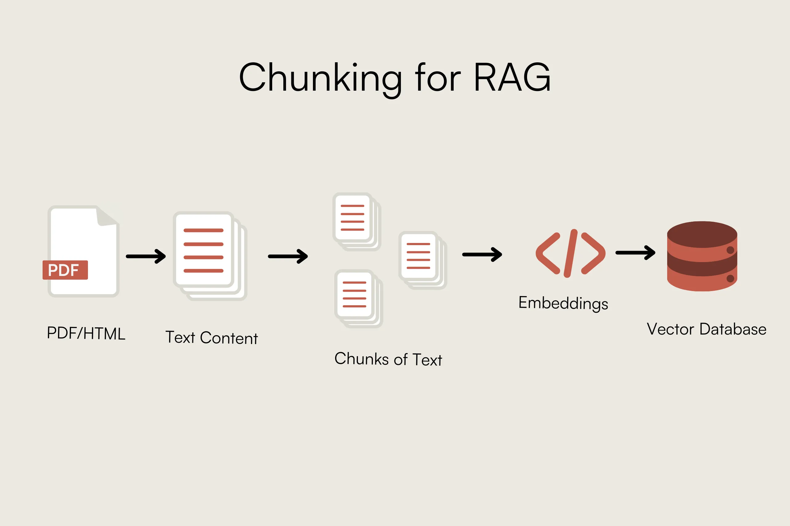
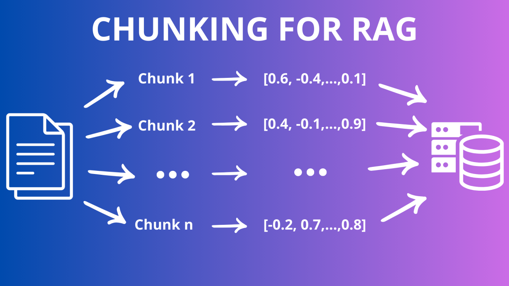

# Chunking: estrategias de fragmentación

**Chunking** = dividir documentos largos en **fragmentos más pequeños** antes de generar embeddings.

Es uno de los factores que más influyen en la calidad del RAG. Un retrieval malo suele empezar por chunks mal dimensionados.

Un **retrieval** es la recuperación de los chunks relevantes para la pregunta del usuario.



Aquí podemos ver el paso de chunking a embeddings:


---

## Objetivos

- Explicar **por qué** fragmentar (y qué pasa si no lo haces).
- Usar **`RecursiveCharacterTextSplitter`** como estrategia por defecto.
- Configurar **`chunk_size`** y **`chunk_overlap`** con criterio.

---

## 1) Por qué no indexar el documento entero

| Enfoque | Problema |
|---------|----------|
| Documento completo en un embedding | Mezcla muchos temas; búsqueda imprecisa |
| Documento entero en el prompt | No cabe en contexto; caro |
| Chunks pequeños y homogéneos | Recuperas el párrafo **relevante** |

```text
Documento de 40 páginas
        │
        ▼
   [ chunk 1 ] [ chunk 2 ] [ chunk 3 ] ...
        │            │
        │            └── embedding distinto por fragmento
        └── cada uno buscable por separado
```

---

## 2) RecursiveCharacterTextSplitter (recomendado)

LangChain intenta cortar en este **orden de separadores**:

```text
"\n\n"  →  "\n"  →  ". "  →  " "  →  carácter
```

Primero respeta **párrafos**, luego **frases**, y solo al final corta a mitad de palabra si hace falta.

```python
from langchain_text_splitters import RecursiveCharacterTextSplitter

splitter = RecursiveCharacterTextSplitter(
    chunk_size=800,
    chunk_overlap=100,
    length_function=len,
)

chunks = splitter.split_documents(documentos)
print(f"Chunks generados: {len(chunks)}")
print(chunks[0].page_content[:300])
```

---

## 3) Parámetros clave

| Parámetro | Significado | Valor orientativo (caracteres) |
|-----------|-------------|--------------------------------|
| `chunk_size` | Tamaño máximo de cada fragmento | 500–1000 para FAQs; 800–1500 para docs densos |
| `chunk_overlap` | Solapamiento entre chunks consecutivos | 10–20 % de `chunk_size` |
| `length_function` | Cómo medir tamaño | `len` (caracteres) o contador de tokens* |

\* Contar tokens (`tiktoken`) es más preciso para límites del LLM; en este sprint usamos **caracteres** por simplicidad.

### Regla del overlap

El solapamiento evita que una frase clave quede **partida** entre dos chunks:

```text
Chunk 1:  "... Actividad: Cine de verano en Hortaleza. Lugar: Parque de Villa"
Chunk 2:  "Parque de Villa Rosa. Distrito: HORTALEZA. Gratuito: sí"
          ^^^^^^^ overlap ^^^^^^^
```

Sin overlap, ningún chunk contiene la frase completa → retrieval falla.

---

## 4) Efecto de chunk_size (intuición)

| chunk_size | Ventaja | Riesgo |
|------------|---------|--------|
| **Pequeño** (300–500) | Precisión en preguntas concretas | Pierde contexto de párrafo |
| **Medio** (700–1000) | Buen equilibrio general | — |
| **Grande** (2000+) | Más contexto por chunk | Mezcla temas; embedding difuso |

**No hay valor universal:** depende del tipo de documento. Por eso en Sprint 9 evaluarás retrieval con preguntas fijas.

---

## 5) Otras estrategias (referencia)

| Splitter | Cuándo |
|----------|--------|
| `CharacterTextSplitter` | Prototipo rápido; un solo separador |
| `RecursiveCharacterTextSplitter` | **Caso general (default)** |
| `MarkdownHeaderTextSplitter` | Docs con `#` / `##` claros |
| `SemanticChunker` | Divide por cambio semántico (coste API) |

En este sprint el **default** es `RecursiveCharacterTextSplitter`. Si tus fuentes son Markdown estructurado (FAQ con `##`), puedes experimentar con `MarkdownHeaderTextSplitter` más adelante.

---

## 6) Inspeccionar chunks antes de embeddear

Siempre imprime o guarda una muestra:

```python
for i, chunk in enumerate(chunks[:5]):
    print(f"--- Chunk {i} ({len(chunk.page_content)} chars) ---")
    print(chunk.page_content[:250])
    print(chunk.metadata)
    print()
```

Preguntas de revisión manual:

- ¿Se corta una definición a la mitad?
- ¿Hay chunks casi vacíos?
- ¿Headers quedaron separados del párrafo que introducen?

---

## 7) Errores frecuentes

| Error | Consecuencia |
|-------|--------------|
| `chunk_size` enorme (5000+) | Un chunk = muchas páginas; retrieval impreciso |
| `overlap = 0` | Información en el límite entre chunks se pierde |
| Chunking **antes** de limpiar | Duplicas ruido en cada fragmento |
| No revisar muestras | Problemas visibles solo en Sprint 9 |

---

## Resumen

- **Chunking** prepara unidades recuperables para embeddings y retrieval.
- Usa **`RecursiveCharacterTextSplitter`** con `chunk_size` ~800 y `overlap` ~100 como punto de partida.
- Ajusta con **inspección manual** y evaluación en Sprint 9.
- Centraliza parámetros en **`config.py`**.