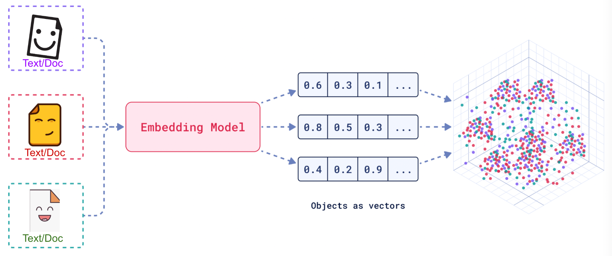
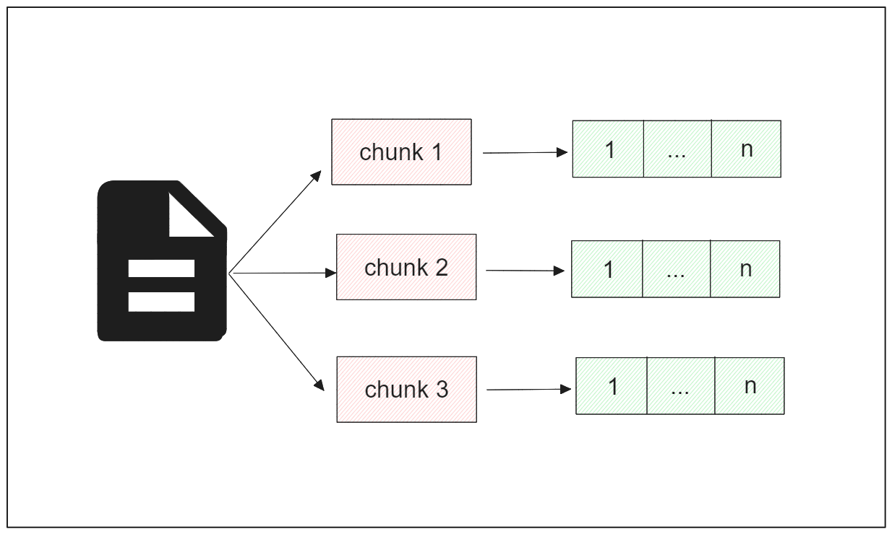
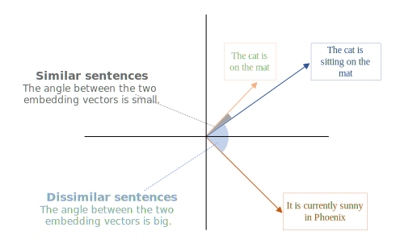
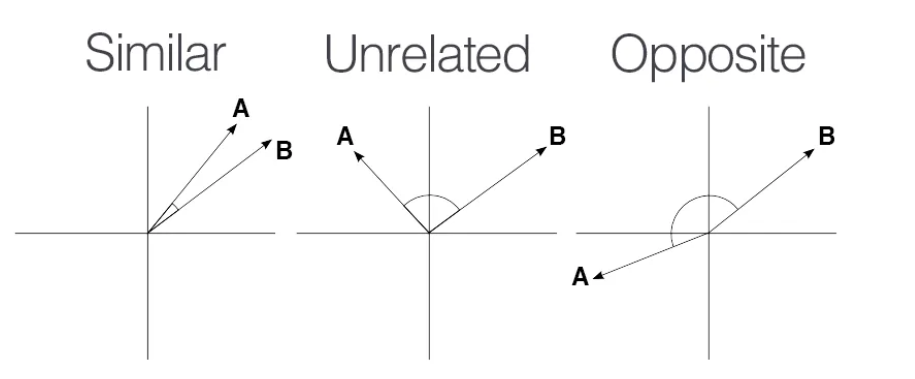
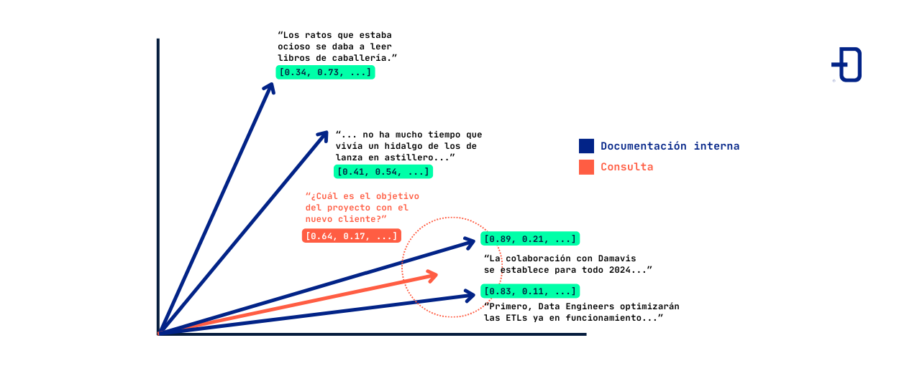
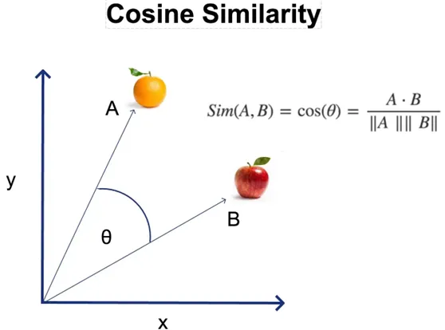

# Vectores y similitud semántica

Un **embedding** transforma texto en una lista de números (vector). La idea no es leer cada número, sino usar **distancia** entre vectores como proxy de **similitud de significado**.



---

## Objetivos

- Intuir qué es un vector de embedding (sin álgebra lineal).
- Entender **similitud del coseno** entre dos vectores.
- Relacionar similitud alta con textos parecidos en significado.

---

## 1) De palabras a números

El modelo de embedding lee un texto y devuelve algo como:

```text
"¿Hay eventos culturales gratuitos en Madrid?"
        │
        ▼
[0.02, -0.15, 0.08, ..., 0.11]   ← cientos de dimensiones (p. ej. 768)
```

| Propiedad | Detalle |
|-----------|---------|
| Dimensión | Longitud del vector (768, 1536…) según modelo |
| Valores | Floats positivos y negativos |
| Interpretación | No número a número; importa la **posición relativa** en el espacio |

Textos **semánticamente cercanos** → vectores **cercanos** en ese espacio.



---

## 2) Similitud del coseno

Mide el **ángulo** entre dos vectores, no su longitud. Resultado típico entre **-1 y 1** (en embeddings de texto suele estar entre **0 y 1**).

```text
        sim = 1.0  →  mismísimo significado (idealizado)
        sim = 0.8  →  muy parecido
        sim = 0.3  →  poco relacionado
        sim ≈ 0    →  temas distintos
```

En RAG, dada la **pregunta del usuario** (vector Q) y **N chunks** (vectores C₁…Cₙ), calculas similitud(Q, Cᵢ) y te quedas con los **top-K** más altos.






---

## 3) Ejemplo numérico mínimo (2D)

Imagina embeddings en solo **2 dimensiones** para dibujarlos:

| Texto | Vector [x, y] |
|-------|---------------|
| «¿Hay eventos gratuitos en Madrid?» | [0.9, 0.1] |
| «Actividades gratis en la agenda municipal» | [0.85, 0.15] |
| «Receta de tortilla de patatas» | [0.1, 0.9] |

La pregunta «¿Hay cine gratuito en agosto?» podría mapear cerca de `[0.88, 0.12]` → más cerca de las dos primeras filas que de la receta.

En producción tienes **768+ dimensiones**, pero la lógica es la misma.

---

## 4) Código: similitud del coseno con numpy

```python
import numpy as np


def similitud_coseno(a: list[float], b: list[float]) -> float:
    va = np.array(a, dtype=float)
    vb = np.array(b, dtype=float)
    denom = np.linalg.norm(va) * np.linalg.norm(vb)
    if denom == 0:
        return 0.0
    return float(np.dot(va, vb) / denom)


v_gratis = [0.9, 0.1]
v_agenda = [0.85, 0.15]
v_receta = [0.1, 0.9]

print(similitud_coseno(v_gratis, v_agenda))   # ~0.99
print(similitud_coseno(v_gratis, v_receta))   # ~0.27
```

---

## 5) Qué NO es un embedding

| Confusión | Realidad |
|-----------|----------|
| «Es un hash del texto» | Textos distintos pueden tener vectores similares si significan lo mismo |
| «Mayor valor = más importante» | Importa la **dirección** del vector, no un solo componente |
| «Sirve para generar respuestas» | El embedding **busca**; el LLM **redacta** después |

---

## 6) Regla de oro para RAG

> **Mismo modelo de embedding** para indexar chunks y para embeddear la consulta del usuario.

Mezclar Gemini al indexar y Hugging Face al consultar (o modelos distintos) **invalida** la comparación de distancias.

---

## Resumen

- Embedding = texto → vector de números.
- Similitud del coseno = qué tan parecidos son dos significados.
- RAG usa eso para elegir chunks antes del LLM.
- Sprint 9 implementará la búsqueda; aquí preparas los vectores.
