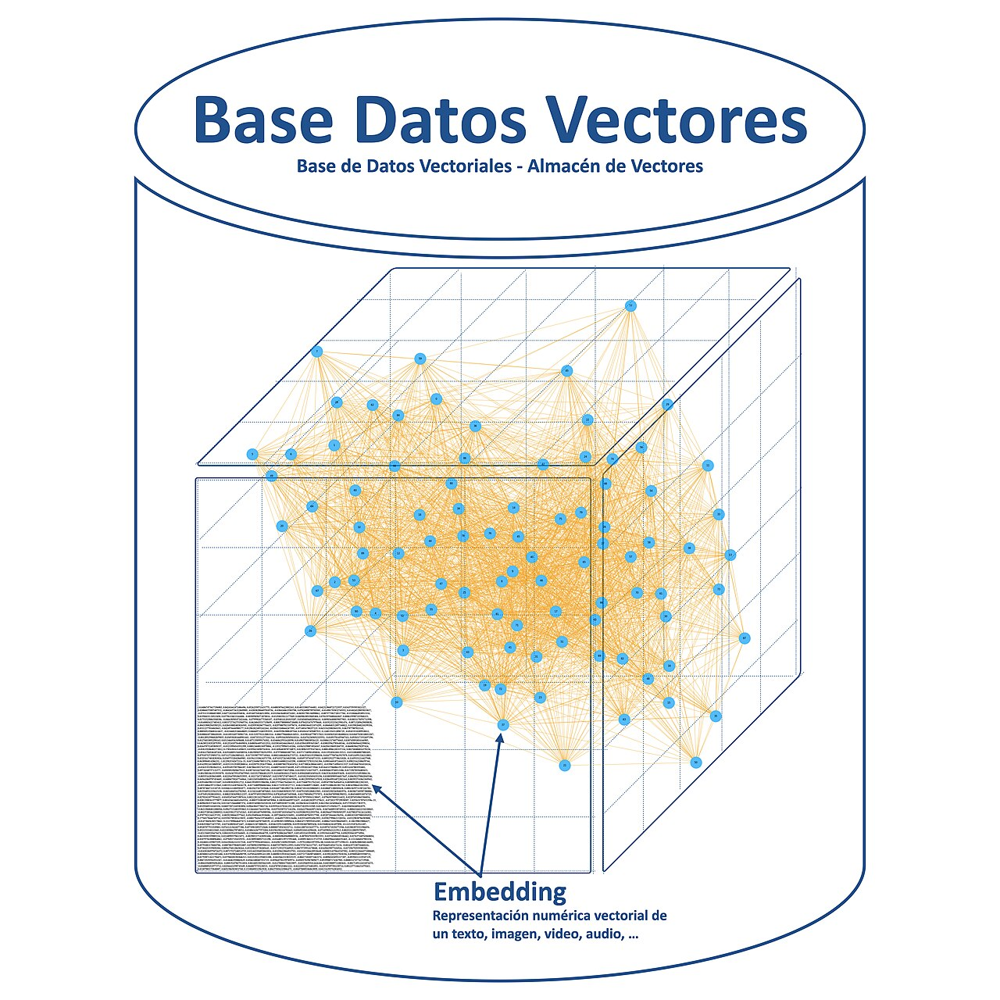
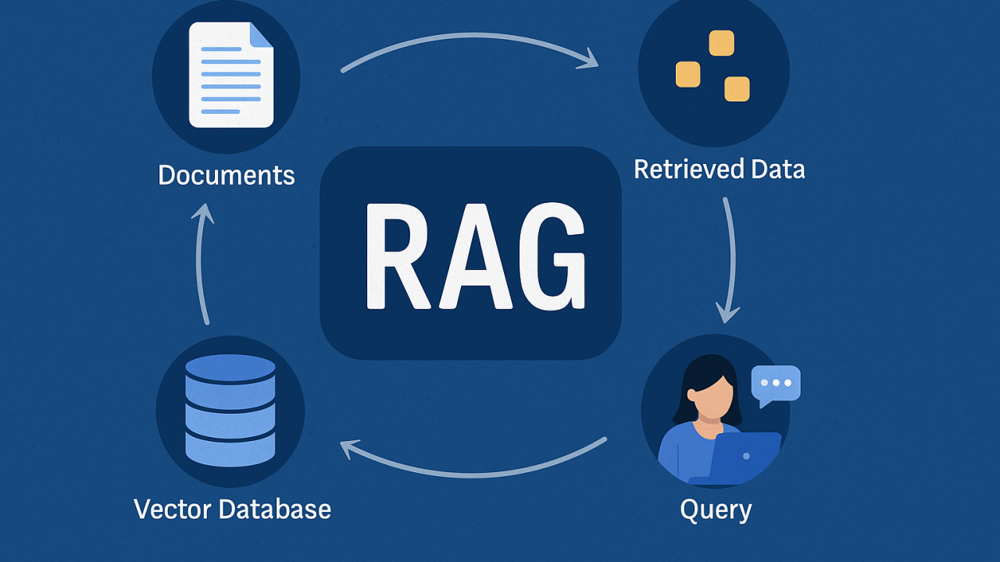
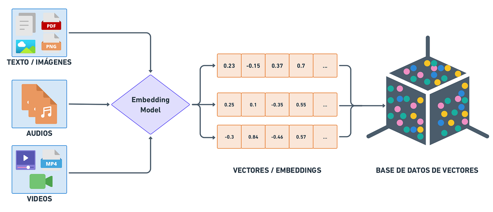
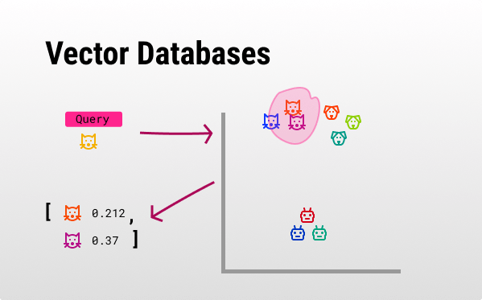

# Bases de datos vectoriales vs bases tradicionales

## Objetivos

- Definir qué es una **base de datos vectorial**.
- Entender por qué una BD relacional o un `LIKE '%cine%'` no sustituyen la búsqueda semántica.
- Saber cuándo combinar ambos enfoques (vectores + metadatos).



---

## 1) Qué es una base de datos vectorial

Una BD vectorial almacena **vectores de alta dimensión** (embeddings) y permite **buscar por proximidad**: dada una consulta convertida en vector, devuelve los vectores más cercanos.

```text
  Corpus indexado                    Consulta
  ───────────────                    ────────
  chunk_0  →  [0.01, -0.03, ...]     "¿Hay cine gratuito?"
  chunk_1  →  [0.02,  0.01, ...]            │
  chunk_2  →  [-0.01, 0.04, ...]            ▼
                                    embed → [0.03, -0.02, ...]
                                            │
                                            ▼
                              ¿Cuáles están más cerca?
```

La operación central es **similarity search** (búsqueda por similitud). ChromaDB, Pinecone, pgvector o FAISS resuelven este problema con estructuras optimizadas (p. ej. HNSW).

En RAG, el vector store es la **memoria a largo plazo** del sistema: el LLM no «recuerda» tus PDFs; el índice vectorial sí.





---

## 2) Por qué no basta una base de datos tradicional

### Búsqueda por keywords (`LIKE`, full-text)

| Consulta | Keywords | Embeddings |
|----------|----------|------------|
| «cine al aire libre gratis» | Encuentra si aparece «cine» | Puede relacionar «cine de verano» y «GRATUITO: 1» |
| «actividades en El Retiro» | Falla si el texto dice «Parque del Retiro» | Suele acercar sinónimos y contexto |


### SQL relacional

SQL es excelente para:

- Filtrar por `distrito = 'RETIRO'`
- Contar eventos por fecha
- Joins entre tablas

Pero **no** ordena filas por similitud semántica de un párrafo libre. Puedes guardar embeddings en PostgreSQL con pgvector, pero el concepto sigue siendo **búsqueda vectorial**, no un `SELECT` clásico.

### Tabla comparativa

| Criterio | SQL / keywords | BD vectorial |
|----------|----------------|--------------|
| Pregunta en lenguaje natural | Débil | Fuerte |
| Sinónimos y paráfrasis | Débil | Fuerte |
| Filtros exactos (fecha, ID) | Fuerte | Complementario (metadata filters) |
| Explicabilidad del match | Palabra encontrada | Distancia / score |

---

## 3) En la práctica: combinar ambos

En un proyecto de RAG se suele combinar ambos enfoques:

- **ChromaDB** encuentra chunks semánticamente cercanos a la pregunta. Esto es la retrieval, que es la parte de la RAG que se encarga de buscar los chunks más relevantes para la pregunta.
- **Metadatos** (`distrito`, `tipo`, `id_evento`) permiten filtrar o citar la fuente. Por ejemplo, si la pregunta es «¿Qué hay gratis en Hortaleza?», se puede filtrar por el distrito y obtener el contexto de los eventos que se celebran en Hortaleza. Esta parte se podría hacer con SQL, pero es más eficiente con vectores.

```text
  Pregunta: «¿Qué hay gratis en Hortaleza?»
       │
       ├─► embed pregunta
       ├─► similarity search en Chroma
       └─► (opcional) filtro metadata distrito=HORTALEZA
```

No es «Chroma **o** SQL»: es **vectores para relevancia semántica** y **metadatos para precisión estructural**.

---

## 4) Qué guarda Chroma por cada chunk

| Campo | Ejemplo | Para qué sirve |
|-------|---------|----------------|
| `id` | `chunk_42` | Identificador único en la colección |
| `embedding` | `[0.01, -0.03, ...]` | Posición en el espacio semántico |
| `document` | Texto del fragmento | Lo que leerás como contexto |
| `metadata` | `{"source": "faq...", "distrito": "RETIRO"}` | Trazabilidad y filtros |

Ejemplos de algunos campos:

```json
{
    "id": "chunk_42",
    "embedding": [0.01, -0.03, ...],
    "document": "Texto del fragmento",
    "metadata": {"source": "faq...", "distrito": "RETIRO"}
},
{
    "id": "chunk_43",
    "embedding": [0.02,  0.01, ...],
    "document": "Texto del fragmento",
    "metadata": {"source": "faq...", "distrito": "HORTALEZA"}
},
{
    "id": "chunk_44",
    "embedding": [-0.01, 0.04, ...],
    "document": "Texto del fragmento",
    "metadata": {"source": "faq...", "distrito": "MORATALAZ"}
}
```
---

## Resumen

- Una BD vectorial indexa embeddings y responde «¿qué fragmentos se parecen a esta consulta?».
- SQL y keywords no sustituyen la similitud semántica en preguntas abiertas.
- En RAG combinas **vector store + metadatos** para recuperación útil y auditable.