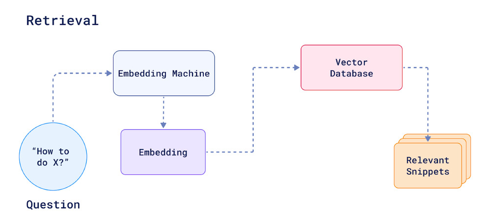
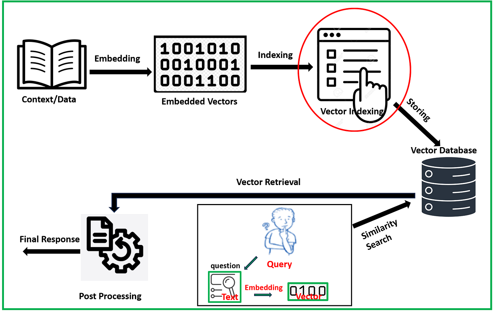
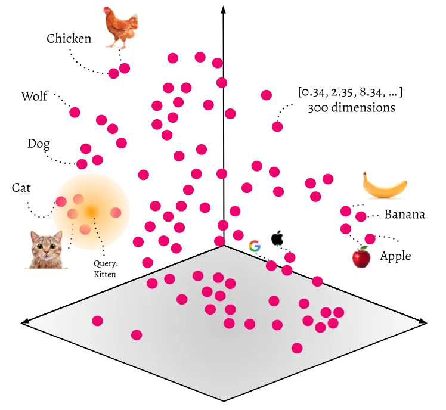
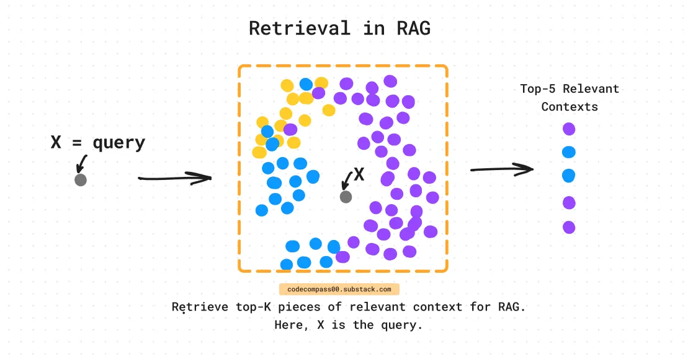

# Retrieval y similarity search

## Objetivos

- Definir **retrieval** en un pipeline RAG.
- Explicar **similarity search** y el parámetro **top-K**.
- Interpretar **distancias** devueltas por Chroma.

---

## 1) Qué es retrieval

El retrieval responde a:

> Dada esta pregunta, **¿qué fragmentos del corpus debería leer el LLM** antes de responder?

Entrada: string en lenguaje natural.  
Salida: lista de chunks ordenados por relevancia estimada (proximidad vectorial).

Sin un retriever fiable, el LLM o inventa (alucina) o responde con conocimiento genérico desactualizado.




---

## 2) Similarity search



**Similarity search** = buscar en el índice los vectores más cercanos al vector de la consulta.

Con métrica **coseno** (configurada en la colección):

- Vectores muy alineados → **distancia baja** (más similares).
- Vectores ortogonales → distancia mayor.

Chroma devuelve `distances` en `collection.query()`. No confundas distancia con «porcentaje de acierto»: es una señal para **ordenar** candidatos, no una verdad absoluta.

```python
results = collection.query(
    query_embeddings=[vector_pregunta],
    n_results=3,
    include=["documents", "metadatas", "distances"],
)
```



---

## 3) Top-K retrieval



**K** = cuántos chunks devuelves al LLM (o al formateador de contexto).

| K | Efecto |
|---|--------|
| K = 1 | Contexto mínimo; riesgo de omitir información |
| K = 3–5 | Equilibrio habitual en demos |
| K muy alto | Mucho ruido, prompt largo, más coste cuando toque hacer la llamada al LLM |


Regla práctica: empieza con K pequeño, **mira los chunks** recuperados y sube K solo si falta información. PAra cambiar la K se puede hacer desde el fichero `config.py` o desde la línea de comandos con `--top-k`.


---

## 4) Ejemplo de flujo de retrieval en `retriever.py` en un proyecto RAG

```text
  pregunta
     │
     ▼
  embeddear_consulta()     ← Gemini, mismo EMBEDDING_MODEL
     │
     ▼
  collection.query(n_results=K)
     │
     ▼
  lista de {text, metadata, distance}
```

El retriever **no** modifica el texto del chunk; solo **selecciona** cuáles pasan al siguiente paso. El retriever es el que se encarga de buscar los chunks más relevantes para la pregunta.

---

## 5) Preguntas de ejemplo (agenda cultural)

| Pregunta | Qué deberías recuperar (idealmente) |
|----------|-------------------------------------|
| «¿Qué significa el campo GRATUITO?» | FAQ o PDF de documentación |
| «¿Hay cine gratuito en agosto?» | Eventos CSV con cine + GRATUITO=1 |
| «Actividades en El Retiro» | Eventos o texto con distrito RETIRO |
| «¿Qué hay gratis en Hortaleza?» | Eventos CSV con cine + GRATUITO=1 y distrito HORTALEZA |

Si los resultados no coinciden, el problema suele estar en **chunking**, **K** o **cobertura del índice** — no en el LLM (que aún no usas). 

---

## Resumen

- Retrieval = selección automática de chunks por similitud semántica.
- Similarity search ordena candidatos; top-K limita cuántos pasan al contexto.
- Interpreta distancias como señal relativa, no como métrica perfecta.
