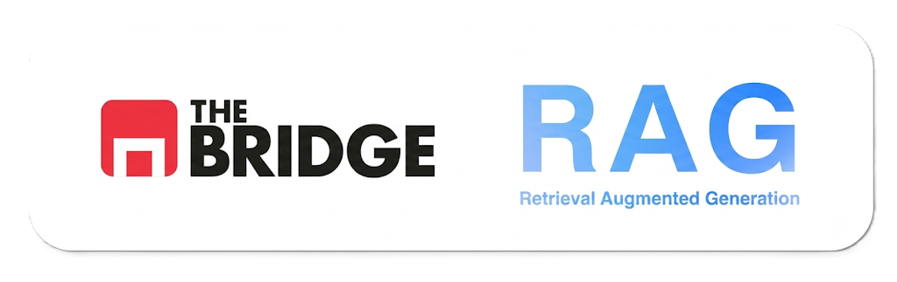

# 📘 Sprint 09 — Retrieval & Vector Search

En el Sprint 8 convertiste documentos en **chunks** y **embeddings**. En este sprint aprendes a **recuperar** el conocimiento: indexarlo en una base vectorial y buscar los fragmentos más relevantes para una pregunta.

El sprint responde a una pregunta central:

> **¿Cómo recupero ese conocimiento?**

Todavía **no** generas respuestas con Gemini. Eso llega en el Sprint 10. Aquí construyes el **motor de búsqueda semántica**.

---

## Mapa del módulo (Sprints 8–10)

| Sprint | Pregunta | Fase |
|--------|----------|------|
| **08** | ¿Cómo convierto documentos en conocimiento? | Preparar |
| **09** (este) | ¿Cómo recupero ese conocimiento? | Recuperar |
| **10** | ¿Cómo uso ese conocimiento para responder? | Generar + aplicación |

```text
PDF / CSV / MD  →  chunks  →  embeddings  →  ChromaDB  →  similarity search  →  top-K
                                                                              (Sprint 9)
                                                                                    ↓
                                                                          prompt + Gemini
                                                                              (Sprint 10)
```

---

## 🗄️ Bloque 1 — Bases de datos vectoriales

📁 [`01_Teoria/01_Bases_de_datos_vectoriales/`](./01_Teoria/01_Bases_de_datos_vectoriales/)

> **Almacenar** embeddings y metadatos para búsqueda por similitud semántica.

*Prerrequisito: Sprint 8 (chunks + embeddings con Gemini).*

### Contenido de teoría

| # | Documento | Qué aprenderás |
|---|-----------|----------------|
| 0 | [Introducción](./01_Teoria/01_Bases_de_datos_vectoriales/00_introduccion_bases_vectoriales.md) | Puente desde S8; objetivo del bloque. |
| 1 | [BD vectorial vs tradicional](./01_Teoria/01_Bases_de_datos_vectoriales/01_bd_vectorial_vs_tradicional.md) | Qué es una BD vectorial; por qué no basta SQL. |
| 2 | [ChromaDB: persistencia y colecciones](./01_Teoria/01_Bases_de_datos_vectoriales/02_chromadb_persistencia_y_colecciones.md) | Cliente persistente, colecciones, metadatos. |
| 3 | [Flujo de indexación](./01_Teoria/01_Bases_de_datos_vectoriales/03_flujo_de_indexacion.md) | De `embeddings.json` a ChromaDB. |

### Workout

| Notebook | Cubre teoría |
|----------|--------------|
| [01_crear_base_vectorial_chromadb.ipynb](./02_Workout/01_Bases_de_datos_vectoriales/01_crear_base_vectorial_chromadb.ipynb) | 2 + 3 |

Índice detallado: [`01_Teoria/01_Bases_de_datos_vectoriales/readme.md`](./01_Teoria/01_Bases_de_datos_vectoriales/readme.md)

---

## 🔍 Bloque 2 — Retrieval y búsqueda semántica

📁 [`01_Teoria/02_Retrieval_y_busqueda_semantica/`](./01_Teoria/02_Retrieval_y_busqueda_semantica/)

> **Recuperar** automáticamente los fragmentos más relevantes para una consulta.

*Prerrequisito: Bloque 1 (colección indexada).*

### Contenido de teoría

| # | Documento | Qué aprenderás |
|---|-----------|----------------|
| 0 | [Introducción](./01_Teoria/02_Retrieval_y_busqueda_semantica/00_introduccion_retrieval.md) | Pasos 1–5 del pipeline online; retrieval ≠ generation. |
| 1 | [Retrieval y similarity search](./01_Teoria/02_Retrieval_y_busqueda_semantica/01_retrieval_y_similarity_search.md) | Qué es retrieval; top-K y similitud. |
| 2 | [Recuperación, embeddings y contexto](./01_Teoria/02_Retrieval_y_busqueda_semantica/02_recuperacion_embeddings_y_contexto.md) | Embed de la pregunta; construir el contexto. |
| 3 | [Configuración del retriever](./01_Teoria/02_Retrieval_y_busqueda_semantica/03_configuracion_del_retriever.md) | Parámetros, retriever modular; LangChain como referencia. |

### Workout

| Notebook | Cubre teoría |
|----------|--------------|
| [01_implementar_retriever.ipynb](./02_Workout/02_Retrieval_y_busqueda_semantica/01_implementar_retriever.ipynb) | 1 + 2 + 3 |

Índice detallado: [`01_Teoria/02_Retrieval_y_busqueda_semantica/readme.md`](./01_Teoria/02_Retrieval_y_busqueda_semantica/readme.md)

---

## 📊 Bloque 3 — Evaluación del retrieval

📁 [`01_Teoria/03_Evaluacion_del_retrieval/`](./01_Teoria/03_Evaluacion_del_retrieval/)

> **Analizar y mejorar** la recuperación antes de enganchar el LLM (Sprint 10).

*Prerrequisito: Bloque 2 (retriever funcionando).*

### Contenido de teoría

| # | Documento | Qué aprenderás |
|---|-----------|----------------|
| 0 | [Introducción](./01_Teoria/03_Evaluacion_del_retrieval/00_introduccion_evaluacion_retrieval.md) | Por qué evaluar retrieval por separado. |
| 1 | [Evaluar calidad y fallos](./01_Teoria/03_Evaluacion_del_retrieval/01_evaluar_calidad_y_fallos.md) | Preguntas de prueba; casos donde falla. |
| 2 | [Ajuste, logging y depuración](./01_Teoria/03_Evaluacion_del_retrieval/02_ajuste_logging_y_depuracion.md) | Chunking, top-K, trazas de depuración. |
| 3 | [Comparación de resultados](./01_Teoria/03_Evaluacion_del_retrieval/03_comparacion_de_resultados.md) | Elegir configuración antes de S10. |

📁 Proyecto ejecutable: [`05_proyecto_rag_retrieval_busqueda_semantica/`](./01_Teoria/03_Evaluacion_del_retrieval/05_proyecto_rag_retrieval_busqueda_semantica/) — pipeline S8 + index + retrieve + eval.

### Workout

| Notebook / guía | Cubre teoría |
|-----------------|--------------|
| [01_evaluar_y_ajustar_retrieval.ipynb](./02_Workout/03_Evaluacion_del_retrieval/01_evaluar_y_ajustar_retrieval.ipynb) | 1 + 2 + 3 |
| [02_proyecto_rag_retrieval_busqueda_semantica.md](./02_Workout/03_Evaluacion_del_retrieval/02_proyecto_rag_retrieval_busqueda_semantica.md) | Enlace al repo del proyecto (Bloques 1–3) |

Índice detallado: [`01_Teoria/03_Evaluacion_del_retrieval/readme.md`](./01_Teoria/03_Evaluacion_del_retrieval/readme.md)

---

## 🧪 Live Review

📁 [`Practica_live_review/`](./Practica_live_review/)

Práctica integradora sobre el corpus **calidad del aire** (continuación del Live Review de Sprint 8): indexar en Chroma, retrieval y evaluación + reflexión. 

| Carpeta | Uso |
|---------|-----|
| [`01_retrieval_calidad_aire/`](./Practica_live_review/01_retrieval_calidad_aire/) | Proyecto alumno (stubs S9) |
| [`01_retrieval_calidad_aire_SOLUTION/`](./Practica_live_review/01_retrieval_calidad_aire_SOLUTION/) | Solución de referencia |

---

## ⚙️ Convenciones del sprint

- Teoría en `01_Teoria/` (markdown + proyecto ejemplo ejecutable).
- Workouts en `02_Workout/` — **notebooks autocontenidos** (`data/`, `output/` y `queries/` compartidos; guiones en `guiones_video/`).
- Proyecto en teoría (`05_proyecto_rag_retrieval_busqueda_semantica/`) = ejemplo ejecutable en `.py` (mismo pipeline que el repo externo).
- **ChromaDB** con API directa (`chromadb`); LangChain solo como referencia en teoría.
- **Gemini** para embed de consultas (mismo modelo que en S8).
- Corpus completo en `02_Workout/data/` (FAQ, guía, PDF y CSV incluidos en el repo).

**Consejo:** al terminar S9 deberías poder hacer una pregunta, ver los chunks recuperados con scores y explicar **por qué** aparecen. Si echas en falta una respuesta redactada por el modelo, es señal de que entendiste el sprint: la generación es Sprint 10.
